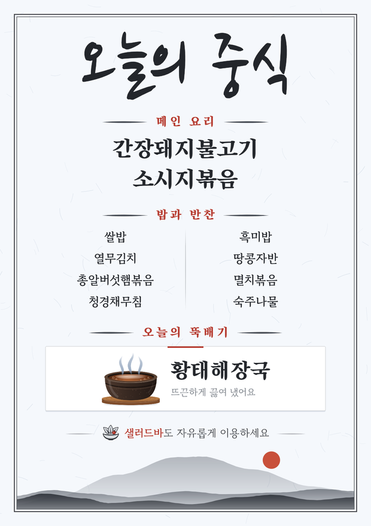

# 메뉴판 만들기

한식뷔페의 오늘 메뉴를 입력하면 A4 메뉴판을 바로 만들어 주는 웹앱이에요. 만든 메뉴판은 이미지로 저장하거나 카카오톡으로 보내고, PDF로 출력할 수 있어요.

**👉 https://kimjuneseo.github.io/menu/**



## 식당에서 쓰는 법

1. 폰에서 위 주소를 열고 홈 화면에 추가하면 '메뉴판' 앱처럼 쓸 수 있어요.
   - 아이폰(Safari): 공유 버튼 → **홈 화면에 추가**
   - 갤럭시(Chrome): 오른쪽 위 ⋮ → **홈 화면에 추가** (또는 앱 설치)
2. **제목**은 '오늘의 중식' / '오늘의 석식' 버튼으로 고르거나 직접 써요.
3. 메인 메뉴, 밥과 반찬, 뚝배기(국) 칸에는 **한 줄에 하나씩** 적어요.
   - 쉼표(,)를 써도 거기서 나뉘니, 메뉴 이름 안에는 쉼표를 쓰지 마세요.
   - 반찬은 자동으로 두 단(왼쪽·오른쪽)으로 나눠 배치돼요.
4. **샐러드바 안내**는 한 줄로 적어요.
   - 비우면 메뉴판에서 빠져요.
   - '샐러드'라는 말이 없으면 앞에 '샐러드바 ·'가 자동으로 붙어요.
5. 저장·공유
   - **이미지 저장·공유**를 누르면 폰 공유 창이 떠요. 아이폰에서는 '이미지 저장'을 고르면 사진첩에 저장되고, 카카오톡을 고르면 바로 보내져요.
   - **인쇄용 PDF**는 A4로 출력할 때 써요.
   - 처음 누를 때 "한 번 더 눌러 주세요"가 뜨면 한 번 더 누르면 돼요.

### 알아 두면 좋은 것

- **날짜:** 제목 아래 날짜는 날이 바뀌면 자동으로 오늘 날짜가 돼요. 전날 밤에 내일 날짜를 미리 써 두면 그대로 남아요.
  - '10월 2일 금요일'처럼 '○월 ○일 ○요일' 모양일 때만 자동으로 바뀌어요.
  - 다른 모양으로 고쳤다면 '문구 바꾸기 → 오늘 날짜로 되돌리기'를 누르세요.
- **저장:** 입력한 내용은 그 폰(브라우저)에만 저장돼요. 다음 날 열면 어제 메뉴가 남아 있고, 폰마다 따로 저장돼요.
- **글씨 크기:** 제목·메인·반찬·뚝배기·샐러드바를 칸마다 70~150%로 바꿀 수 있어요. 내용이 넘치면 한 장에 맞게 자동으로 조금 줄여요.
- **문구 바꾸기:** 칸 이름(메인 요리, 밥과 반찬, 오늘의 뚝배기), 날짜 줄, 맨 아래 인사말을 바꿀 수 있어요.
- **예시 메뉴로 되돌리기:** 실수로 지우지 않게 두 번 눌러야 실행돼요. 글씨 크기는 그대로 남아요.

## 고치는 법

- `index.html` 한 파일만 고치면 돼요. 빌드가 없어서 브라우저로 바로 열어서 확인할 수 있어요.
- `main` 브랜치에 푸시하면 GitHub Pages에 1분 안팎으로 반영돼요. 다만 최근에 연 폰은 최대 10분 동안 예전 화면이 보일 수 있어요. 식당에서 쓰는 화면이니 확인하고 올려 주세요.
- **디자인을 바꿀 때:** `docs/design.md`에 정해진 방향과 이유가 있어요.
- **Claude Code로 작업할 때:** `CLAUDE.md`가 자동으로 읽혀요. 코드 구조, 지켜야 할 것, 확인·배포 방법이 정리돼 있어요.

### 확인 스크립트 (`tools/`)

메뉴판이 제대로 그려지는지, 저장 버튼으로 파일이 나오는지 확인해요. Node.js 18 이상과 Chrome 또는 Edge가 필요해요.

```sh
cd tools
npm install
npm run check                                   # 여러 상태를 tools/out/*.png 로 그리고, 저장 버튼으로 PNG·PDF가 나오는지 확인
```

## 파일 구성

| 파일 | 내용 |
|---|---|
| `index.html` | 앱 전체 (입력 화면 + 메뉴판 그리기 + 저장) |
| `manifest.webmanifest`, `icon-*.png`, `apple-touch-icon.png` | 홈 화면 아이콘과 앱 정보 |
| `docs/design.md` | 디자인 결정과 색·글꼴·배치 |
| `tools/` | 확인용 스크립트 (앱 동작과는 관계없어요) |
| `CLAUDE.md` | Claude Code 작업 안내 |
