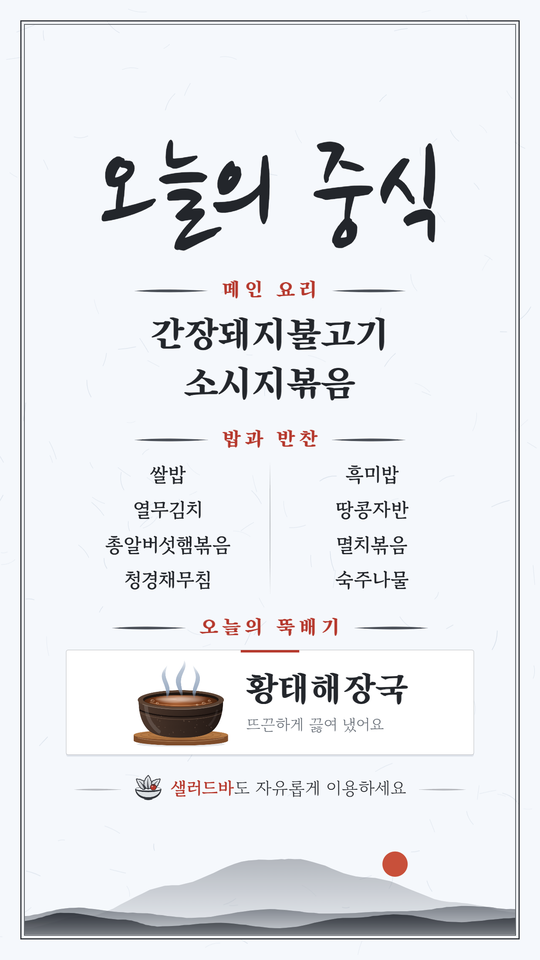

# 메뉴판 디자인

지금 디자인은 **'한지와 붓글씨'** 시안에 바탕을 **파란 기가 살짝 도는 흰색**(#F5F8FC)으로 바꾼 버전이에요. 붓글씨 제목과 수묵화 한라산으로 분위기를 살리면서, 어르신 손님도 멀리서 읽을 수 있게 메뉴 글씨를 크고 진하게 했어요.

| A4 메뉴판 | 인스타 스토리 |
|---|---|
|  |  |

## 정해진 것과 이유

| 항목 | 결정 | 이유 |
|---|---|---|
| 전체 스타일 | 한지·붓글씨 시안 | 시안 3개(돌담과 감귤 / 제주 바다 / 한지와 붓글씨) 중에서 골랐어요 |
| 바탕색 | #F5F8FC | 한지 베이지(#F0E8D9) 대신 파란 기 도는 흰색을 원했고, 3가지 농도 중 가장 은은한 안을 골랐어요 |
| 사투리 | 쓰지 않음 | 요청으로 '혼저옵서예'·'하영 드십서예'를 뺐어요 |
| 날짜 | 메뉴판에 넣지 않음 | 요청으로 제목 아래 날짜 줄을 뺐어요. 저장 파일 이름에는 날짜가 들어가요 |
| '제주' 낙관 | 넣지 않음 | 요청으로 제목 옆 빨간 도장을 뺐어요. 그만큼 제목이 가로폭을 더 써요 |
| 맨 아래 인사말 | 기본은 없음 | 필요하면 '문구 바꾸기'에서 넣을 수 있어요 |
| 메인 칸 이름 | 메인 요리 | 뷔페는 다 골라 먹을 수 있어서 '오늘의 추천'이 어색했어요. 이름만 바꾸는 거라 '문구 바꾸기'에서 고칠 수 있어요 |
| 뚝배기 그림 | 건더기 없이 국물과 김만 | 국이 매일 바뀌어요. 예전 그림은 황태해장국처럼 보였어요 |
| 뚝배기 칸 | 흰 카드 | 베이지 칸이 마음에 안 든다고 했고, 수정 3안(청자색 / 먹선 테두리 / 흰 카드) 중 흰 카드를 골랐어요 |
| 샐러드바 | 카드 밖 아래에 따로 한 줄 | 카드 안에 넣는 안보다, 다른 영역으로 나눈 안(먹선 그릇 아이콘 + 빨간 '샐러드바')을 골랐어요 |
| 샐러드바 문구 | 기본 '샐러드바도 자유롭게 이용하세요' | '무료'·'무제한'처럼 확인하지 않은 표현은 쓰지 않아요 |
| 글씨 크기 | 칸별 70~150% | 글씨 크기를 직접 바꿀 수 있게 해 달라는 요청이 있었어요 |
| 인스타 스토리 | 1080×1920 판형 추가 | 인스타 스토리로도 올릴 수 있게 해 달라는 요청이 있었어요. 디자인은 A4와 같고 세로만 길어요 |

### 아직 식당에 확인할 것

- 국을 직원이 떠 드리는지, 손님이 직접 뜨는지 확인이 필요해요. 이에 따라 국 아래 문구를 정해요. 지금 기본값은 어느 쪽이든 맞는 '뜨끈하게 끓여 냈어요'예요.
- 정확한 상호, 간판·매장 사진을 받으면 상호를 넣거나 색을 맞출 수 있어요.

## 색 (`C` 토큰)

| 이름 | 값 | 쓰는 곳 |
|---|---|---|
| paper | #F5F8FC | 바탕 |
| fiber | #C7D2DF | 한지 섬유결 (A4 120가닥, 스토리는 높이에 비례해 151가닥, 고정 시드) |
| ink | #23262B | 제목·메뉴 글씨, 테두리 |
| muted | #636A73 | 국 설명, '샐러드바 · '의 가운뎃점 |
| stroke | #4A4F57 | 칸 제목 양옆 붓선 |
| seal | #B5372B | 빨간 칸 제목, 카드 위 짧은 선, '샐러드바' 글자, 맨 아래 인사말 |
| card / cardLine / shade | #FFFFFF / rgba(35,38,43,.20) / rgba(40,62,96,.10) | 뚝배기 카드 바탕 / 테두리 / 아래로 4만큼 비낀 그림자 |
| hair | rgba(35,38,43,.24) | 반찬 두 단 사이 세로 붓선 |
| sun | #C8503A | 수묵 산 위 붉은 해 |

## 글꼴과 크기 (k=1, 글씨 크기 100% 기준)

| 요소 | 글꼴 | 크기 | 기타 |
|---|---|---|---|
| 제목 | Nanum Brush Script | 236 | 획을 조금 덧그려 굵게(0.024). 가로폭(936)을 넘으면 줄임. 아래에 14만큼 여백 |
| 칸 제목 | Song Myung | 42 | 빨강, 자간 0.22, 양옆에 길이 150의 붓선 |
| 메인 메뉴 | Song Myung | 78 | 가운데 정렬 |
| 밥과 반찬 | Gowun Batang 700 | 40 | 두 단, 줄 간격 72 |
| 국 이름 | Song Myung | 74 | 56보다 작아질 만큼 길면 두 줄 |
| 국 설명 | Gowun Batang 400 | 32 | muted |
| 샐러드바 줄 | Gowun Batang | 36 | '샐러드(바)'만 700 빨강, 나머지 400. 문구에 '샐러드'가 없으면 앞에 '샐러드바 · '를 붙임(가운뎃점은 muted). 한 줄로는 크게 줄어들 만큼 길면 두 줄(괄호 안에서는 나누지 않음) |
| 맨 아래 인사말 | Song Myung | 40 | 빨강 |

글씨 크기 조절은 위 크기와 해당 칸 높이에 배율을 곱해요. 제목은 가로폭이 차면 더 커지지 않아요.

## 배치 (A4: 1240×1754)

- **테두리:** 각진 이중선이에요. 바깥은 48 위치에 2.6px, 안쪽은 56 위치에 1.4px.
- **내용 폭:** x 152부터 폭 936까지 쓰고, 가운데 정렬해요.
- **아래 띠:** 맨 아래 196 높이에 수묵 한라산 3겹(뒷산·중간 능선·앞산)과 붉은 해가 들어가요. 내용은 띠보다 10 위에서 끝나요.
- **세로 순서:** 제목 → 메인 요리 → 밥과 반찬 → 오늘의 뚝배기(흰 카드) → 샐러드바 줄 → (맨 아래 인사말).
- **공간 배분:** 남는 공간은 먼저 위아래 여백 22씩에 주고, 나머지를 블록 사이 간격(28~60)에 줘요. 그래도 넘치면 전체를 같은 비율로 줄여요.
- **뚝배기 카드:**
  - 모서리 4, 가는 테두리, 그림자를 넣고, 윗변 가운데에 120×5 빨간 선을 둬요.
  - 왼쪽에는 뚝배기 그림(폭 200)이 들어가요. 나무 받침, 검은 흙빛 그릇, 호박빛 국물, 기포, 김으로 이뤄져 있어요.
  - 오른쪽에는 국 이름과 설명이 들어가요.
- **샐러드바 줄:** 왼쪽에 먹선 그릇 아이콘(잎 세 장 + 방울토마토)을 둬요. 한 줄이고 양옆에 자리가 남을 때만 옅은 붓선이 들어가요.

## 인스타 스토리 (1080×1920)

- **크기:** 가로 1240 기준을 그대로 두고 세로만 2204.4(= 1920×1240/1080)로 늘려 그린 뒤, 1080×1920으로 저장해요. 그래서 글꼴·배치 수치는 A4와 같아요.
- **가려지는 곳:** 인스타 스토리는 위아래 약 250px(1920 기준)이 프로필 줄과 메시지 입력 줄에 가려져요. 그래서 메뉴 글씨는 위 314(실제 약 273px) 아래부터, 아래 344(실제 약 300px) 위에서 끝나요. 붓글씨 제목은 획이 위로 조금 삐져나와서 위쪽을 넉넉히 뒀어요. 테두리와 수묵 산·해는 장식이라 가려지는 곳에 있어도 괜찮아요.
- **글씨 크기:** 세로가 긴 만큼 전체 배율을 A4보다 최대 1.12배까지 키워요.
- **PDF:** 인쇄용이라 스토리를 골라도 늘 A4로 만들어요.

## 지난 시안

- **시안 1 · 돌담과 감귤:** 처음 앱 디자인이에요. 크림색 바탕에 귤나무와 현무암 돌담을 그렸어요.
- **시안 2 · 제주 바다:** 위쪽에 한라산과 파도를 깐 굵은 고딕체 버전이에요.
- **시안 3 · 한지와 붓글씨:** 지금 디자인의 바탕이에요.
- **수정 3안:** 시안 3에서 뚝배기와 칸 배경을 다시 다듬은 3가지 안이에요. 1 청자 뚜껑 뚝배기, 2 수묵 먹선, 3 흰 카드 + 붉은 포인트였고, 3의 카드와 뚝배기, 2의 샐러드바 줄을 합쳤어요.
